We stand on the shoulders of giants.

# nextsycl

A Rust runtime for language, image, video and audio models on Intel Arc GPUs, with SYCL kernels. Each kind of model has a
contract its server and command line drive, and each model architecture its own engine behind it, tuned end to end -
a library another program can use without the server (`docs/architecture.md`). New models are welcome:
`CONTRIBUTING.md` walks through a port, from each kind's template engine. The language models today:
**GLM-5.3-Flash** (`glm5-next`, `llm/glm5next`): 45 layers of KDA and MLA attention with a DSA lightning
indexer, 288 experts, and hyper-connections. The experts that do not fit the cards live in pinned host memory, and
the GPU reads them over PCIe. It runs on one card or splits the layers over several. And
**Qwen3.8-Flash-Next** (`qwen4exp`, `llm/qwen4exp`): Gated DeltaNet and QSA attention, hyper-connections, a
hashed per-layer embedding and 512 experts, on the Strata SYCL port's kernels - every weight in VRAM over the two
cards or on one with its cold experts in pinned host memory, the MTP draft layer, the window and the drafter as SYCL
graphs; verify passes and batches bit-exact, greedy output with drafts equal to output without. Every model's speed at
each context length: [Speed by model](#speed-by-model). **Qwen-Image 2.1**
(`image/qwenimage21`): text to image, its Qwen3-VL text encoder, 7B DiT and RGBA VAE all in SYCL, checked stage by
stage against the reference on the same quantized files; 1024x1024 in 40 steps takes 23.8 s on the B70 (16.5 s with
int8 weights), 37.5 s on the B65. **MiniMax H3** (`video/h3`): text, pictures, a voice and other clips to video with
sound - H3's SYCL engine moved in whole (its jobs, daemon, studio and tools as `nextsycl video ...`), with its own
speed: a 896x672, 4.5 s clip in 87-95 s on the B70 (8 s a step), H3's 98 s. **MiniMax Music 3**
(`audio/minimaxmusic3`): songs from lyrics and a description, up to six minutes of 44.1 kHz stereo - its 8B semantic
language model, RVQ depth decoder, 2.4B flow-matching transformer and Flow-VAE decoder in SYCL, checked stage by stage
against MiniMax's diffusers code on the same files; a minute of song in 89 s on the B70 with the language model in
int8 (118 s in half).

A skill for porting to SYCL on Arc - the safety rules, migration traps, parity method, profiling and what made
things fast, learned on these ports: [skills/sycl-porting/SKILL.md](skills/sycl-porting/SKILL.md).

## Supported models

What `nextsycl models search` lists and `nextsycl models pull <id>` installs (direct links, sizes and SHA-256 in
`glue/models/catalog.json`). **Checked**: compared stage by stage with a reference run on the same files. **Served**:
running in daily use here, with its speed measured. **Listed**: in the catalog, not yet run on this machine.

**Language** (`nextsycl llm`)

| id | model | engine | size | status |
|---|---|---|---|---|
| `glm-5.3-flash-uncensored`, `-128k`, `-256k` | GLM-5.3-Flash uncensored IQ2, 64K / 128K / 256K context | `glm5next` | 89.9 GiB | checked (llama.cpp), served on both cards |
| `qwen3.8-flash-next-iq2_xs` | Qwen3.8-Flash-Next IQ2_XS | `qwen4exp` | 63.4 GiB | served (verify passes and batches exact) |
| `qwen3.8-flash-next-iq2_xs-uncensored` | the same with the refusal projection (a control vector) | `qwen4exp` | 63.4 GiB | served |
| `qwen3.8-flash-next-coder-iq1_m`, `-uncensored` | Qwen3.8-Flash-Next Coder IQ1_M | `qwen4exp` | 54.4 GiB | served |
| `swift-1.5-iq2_xs` | Swift 1.5 IQ2_XS (short thinking) | `qwen4exp` | 63.5 GiB | served |

**Image** (`nextsycl image`; sizes with the text encoder, VAE and tokenizer)

| id | model | engine | size | status |
|---|---|---|---|---|
| `qwen-image-2.1-q8` | Qwen-Image 2.1 Q8_0: text to image (RGBA), edits and compositions of up to 8 pictures | `qwenimage21` | 16.4 GiB | checked, served |
| `qwen-image-2.1-turbo-q8` | Qwen-Image 2.1 Turbo (Viggle v0.3 merged): 6 steps | `qwenimage21` | 16.5 GiB | checked |
| `qwen-image-2.1-q6k`, `-uncensored-q8` | Qwen-Image 2.1 Q6_K; the uncensored model in Q8_0 | `qwenimage21` | 14.8 / 16.4 GiB | listed |
| `qwen-image-2.1-q4km`, `-uncensored-q4km` | Q4_K_M | `qwenimage21` | 13.6 GiB | listed (needs Q5_K in the dequant) |

**LoRAs** for Qwen-Image 2.1 (`--lora NAME[:SCALE]`, merged at load)

| id | what | status |
|---|---|---|
| `qwen-image-2.1-uncensored-lora` | the uncensored change, rank 16 | checked |
| `qwen-image-2.1-turbo-lora` | Viggle's 6-step turbo, rank 128 (brings its sigmas) | served |
| `qwen-image-2.1-pruna-8step-lora` | Pruna's 8-step distill (brings its sigmas) | checked |
| `qwen-image-2.1-pruna-5step-lora` | Pruna's 5-step distill | listed |

**Video** (`nextsycl video`: text, pictures, a voice and other clips to video with sound)

| id | model | engine | size | status |
|---|---|---|---|---|
| `minimax-h3` | MiniMax H3: the 50-block FL2VA DiT in int8 ConvRot (the fastest), the Qwen3-VL 32B text encoder (Q4_K_M), video and audio VAEs, the latent upscaler | `video/h3` | 42.6 GiB | served (H3's own engine moved in; checked against it) |
| `minimax-h3-q6k`, `-q4km` | the denoiser as a Q6_K / Q4_K_M GGUF: less of the card, longer clips | `video/h3` | 38.5 / 33.6 GiB | served by H3 |
| `minimax-h3-q8` | the denoiser as a Q8_0 GGUF (a reference form) | `video/h3` | 43.0 GiB | listed |
| `minimax-h3-realism-lora`, `-ref2v-turbo-lora`, `-lms-lora` | LoRAs: realism (people), ref2v in 4 steps, LMS | | | listed (realism: served by H3) |

**Audio** (`nextsycl audio`: songs from lyrics and a description)

| id | model | engine | size | status |
|---|---|---|---|---|
| `minimax-music3` | MiniMax Music 3: the 8B semantic language model and RVQ depth decoder (half on the card), the 2.4B flow transformer, the Flow-VAE decoder; up to 6 minutes, 44.1 kHz stereo | `minimaxmusic3` | 26.6 GiB | checked, served |
| `minimax-music3-int8` | the same files, the language model and depth decoder in int8 at load: half the VRAM, 1.7x the frames a second | `minimaxmusic3` | 26.6 GiB | checked, served |

## What it does

- **Two cards:** the layers split over the GPUs (each with a SYCL context of its own), the experts in an exclusive
  VRAM / pinned-RAM store.
- **MTP speculative decoding:** the model's own draft block drafts a token, a pass verifies it with the next.
  Verify passes are bit-identical to one-token decode (2 to 5 rows, short and long context: `nextsycl spec-check
  --rows`), so greedy output with MTP equals greedy output without it. At a temperature the draft is sampled from
  the draft block's own distribution and kept with min(1, p/q) (speculative sampling): what is committed is
  distributed exactly as plain sampling, and more drafts are accepted when the model is unsure (61.6% -> 65.0% over
  three prompts at 0.7 / 1.0). Qwen3.8-Flash-Next draws a sampled request's tokens on the GPU (Philox(seed,
  position), the top 64 tokens before top-p) and draws each draft from the draft layer with the uniform of the row
  that will verify it (Strata's coupled draft sampling): 69-70% of drafts accepted at 0.7 / 1.0 instead of 60-64%,
  the text exactly the draws, and the same `seed` the same text. Prompt-lookup drafts (`NS_NGRAM`) are there too, exact, off: on this MoE a longer
  verify pass costs nearly its rows (each brings its own experts).
- **Long context, to 256K:** the DSA indexer past 2,048 tokens (each row attends to its top 512 pools of 4 tokens and
  its own unfinished pool), checked against llama.cpp; a context per session (`--ctx 262144,32768` / `NS_CTX`: one
  long session and a short one; default two of 64K). A 253K-token prompt reads in 249 s (~1,020 tok/s) and decodes at
  ~15 tok/s at that depth; a follow-up on it restores its checkpoint in seconds. The model is trained to 1M tokens
  (no RoPE in its MLA); a passphrase is found at 10 / 50 / 90% of 32K-249K documents (`bench --needle`, 9 of 9). The
  latent cache in q8 (544 bytes a token and layer; `NS_KV=f16` for fp16's 1,024 - the same needle result, benchy
  the same or a little faster with q8: `docs/benchy/v1-2026-10-07-q8.md`). Plan and measurements: `docs/256k-context.md`.
- **A prompt path on the XMX units:** prompts are read in chunks of 6,144 tokens, with the dense matrices and MLA's
  attention in fp16 through oneMKL's half GEMMs, and the experts that live in host memory copied on a second queue
  while the previous ones compute. The experts with few tokens skip the fp16 copy: their 2-bit weights are decoded
  straight into the matrix units - gate | up in ESIMD (`xmx::dpas`, a work-group sharing each block's decode through
  local memory; up to 256 tokens on a B70, 128 on a B65), down in `joint_matrix` (up to 128); larger experts are
  expanded to fp16 and multiplied by oneMKL. A prompt over a chunk runs the two GPUs as a pipeline.
- **A prompt cache:** checkpoints of the whole conversation state in host memory, at the end of a prompt's first
  turn, at the start of its last user turn, and at its end; those pushed out of memory go to disk
  (`NS_CACHE_DIR`, default `~/.cache/nextsycl/prompts`, `NS_CACHE_DISK_GIB` 32), and a stop writes the rest there -
  a 256K prompt's checkpoint is ~3.5 GiB, mounted again in seconds instead of re-reading the prompt for minutes.
  The files outlive the server (another context size of the same model and cache form takes them); one unused for
  `NS_CACHE_TTL_HOURS` (24) is removed, and past the size budget the least recently used go first.
- **An OpenAI-compatible server** with streaming and the thinking split out, run as a service: `nextsycl llm start`,
  `stop`, `status`, `ps`, `cache`, `chat`, `logs`, over a control socket.
- **Tool calls (Qwen3.8-Flash-Next):** OpenAI's `tools` go into the model's own template (its `<tools>` list and
  `<tool_call><function=..><parameter=..>` format); the answer's calls come back as `tool_calls`, each argument typed
  by the tool's schema, with `finish_reason: "tool_calls"`, streamed or not; `tool` messages and earlier calls are
  written back in the template's form. The text before a call streams as it comes. GLM-5.3 takes no tools yet.
- **Energy and logprobs in every answer:** `usage.energy_wh` (and `energy_wh` on `/api/chat`'s last line) - the watt-hours
  both cards drew for the request; `logprobs: true` (+ `top_logprobs`, up to 20) returns each answer token's
  log-probability and the likeliest alternatives, as OpenAI's `choices[0].logprobs.content`, streamed or not.
- **Several requests at once:** up to `NS_PARALLEL` (2) conversations decode together - one pass carries a token of
  each, the weights read once for all of them, each row exactly as its own pass would be (`nextsycl batch-check`);
  a single request decodes alone, with the draft block. More wait in order.
  A long prompt is read in one pass that stops at a chunk's end when another request arrives; then in groups of
  chunks with the others' decode steps between them (a chat sent during a 253K prompt's read is answered in ~10 s,
  at ~18 tok/s).
- **LogProbChain** (`logprob_chain: true`, experimental): each answer token's logprob also chained through the attention
  to the turn's own earlier tokens - an answer that only repeats its thinking counts only as sure as the thinking was
  (below).
- **A record of each request:** `nextsycl llm inspect <id>` prints one as JSON (settings, timings, previews of the prompt
  and the answer); the server keeps the last `NS_KEEP_REQUESTS` (100).
- **`POST /api/chat` for web pages:** the same chat as JSON lines (`{"thinking": ...}`, `{"content": ...}`, then a
  `{"done": true, ...}` line with the timings), with CORS for loopback pages and the origins in `NS_CORS`.

## Quick start

```sh
./build.sh                          # the kernel libraries and the program, in a container with oneAPI (podman)
echo "NS_MODELS=$HOME/models" > nextsycl.conf
dist/nextsycl models add glm ~/models/GLM-5.3-Flash-IQ2.gguf --gpu all   # register a model (or models pull <id> from the catalog)
dist/nextsycl llm start glm         # load it; the OpenAI API on 127.0.0.1:8085
dist/nextsycl llm status            # live: the GPUs, the request running, the prompt cache
dist/nextsycl llm inspect 4         # one request as JSON (settings, timings, previews; NS_KEEP_REQUESTS are kept)
dist/nextsycl llm chat "Hello"
dist/nextsycl llm stop
```

`dist/nextsycl help` lists every command and setting.

What the commands show during and after a chat (GLM-5.3-Flash IQ2 on an Arc Pro B65 and an Arc Pro B70, the B70
last):

```
$ nextsycl llm status
glm-5.3-flash-uncensored - up 1m44s, context 65536, MTP on, 2 request(s) served

GPU  CARD                      VRAM USED      FREE   LAYERS EXPERTS VRAM/HOST   TEMP   VRAM   POWER
1    Arc Pro B65        30.1GiB / 31.9GiB    1.8GiB     0-21      3784 / 2080    36C    38C     77W
0    Arc Pro B70        30.1GiB / 31.9GiB    1.8GiB    22-44      3633 / 3496    42C    40C    105W
                                                                       the GPUs draw 183 W

request #2 (socket): generating, prompt 23 tokens, 0 reused (none), 166 / 400 generated at 20.5 tok/s, 9s, 1565 J so far
prompt cache: (busy)

$ nextsycl llm ps
ID     VIA     STATE        PROMPT           REUSED    READ  GENERATED   TOK/S    ENERGY  AVG W FINISH       AGO
#2     socket  done             23           0 none    0.8s        169    20.2    1613 J    175 stop         34s
#1     socket  done             20           0 none    1.1s        195    19.5    1903 J    171 stop       2m08s

$ nextsycl llm inspect 2
{
  "answer": {
    "chars": 873,
    "preview": "The sky appears blue because of a phenomenon called Rayleigh scattering. Sunlight is made up of all the colors of the visible spectrum, and as it passes through Earth's atmosphere, it collides with molecules of nitrogen and oxygen—particles much smaller than the wavelengths of visible light. Shorter..."
  },
  "api": "/v1/chat/completions",
  "avg_watts": 174.8,
  "checkpoints_saved": 0,
  "drafts": [75, 94],
  "ended": 1791318178,
  "energy_j": 1613.1,
  "finish": "stop",
  "generate_seconds": 8.385545438,
  "generated": 169,
  "id": 2,
  "last_user": "Explain in a paragraph why the sky is blue.",
  "max_tokens": 400,
  "messages": 1,
  "model": "glm-5.3-flash-uncensored",
  "prompt_chars": 43,
  "prompt_tokens": 23,
  "read_seconds": 0.843844816,
  "reused": 0,
  "settings": {"effort": "low", "max_tokens": 400, "stream": true, "temperature": 1.0, "top_p": 0.95},
  "source": "none",
  "started": 1791318169,
  "state": "done",
  "thinking": {"chars": 0, "preview": ""},
  "tok_s": 20.153727774720338,
  "via": "socket"
}
```

TEMP and VRAM are the cards' package and memory temperatures, POWER each card's draw over the last second, and
ENERGY what both cards drew while the request ran (idle power included) - from the xe driver's sensors. `drafts` is
MTP's accepted / proposed drafts; `reused` the prompt tokens the prompt cache or the live session already held.
Every API answer carries the same energy as `usage.energy_wh` (here 0.448 Wh).

## Models

The models a machine serves are entries in one registry (`NS_REGISTRY`, a JSON file; default
`~/.config/nextsycl/models.json`). An entry has the GGUF file (its first shard), the GPUs, the session contexts, the
engine settings (`NS_QW_MTP`, `NS_QW_CVEC` and the like), whether it is offered, and what a client may send it
(tools, background tasks). Its id is the model id clients see and the name the server answers under;
`nextsycl llm start <id>` runs it.

```sh
nextsycl models list [--json]
nextsycl models add <id> <file.gguf> [--title T] [--gpu 0[,1] | all] [--ctx N[,M...]] [--set NAME=VALUE]...
                    [--no-tools] [--no-tasks] [--disabled]
nextsycl models search [TEXT] [--kind llm|image|video|audio|lora]   # the catalog of supported models
nextsycl models pull <id>... [--dir DIR] [--from DIR]... [--verify] [--again]   # download (resumable), SHA-256, register
nextsycl models remove <id> [--files]        # --files deletes the GGUF shards too
nextsycl models enable <id> | disable <id>
nextsycl llm start <id>
nextsycl llm serve <id>                      # the same in the foreground, its log here
```

```
$ nextsycl models list
ID                                           STATE        SIZE  GPUS     CONTEXT          TITLE
glm-5.3-flash-uncensored                     enabled     89.9G  all      65536            GLM-5.3-Flash uncensored IQ2 · 64K context (both GPUs)
glm-5.3-flash-uncensored-256k                enabled     89.9G  all      262144,32768     GLM-5.3-Flash uncensored IQ2 · 256K context + a 32K chat (both GPUs)
qwen3.8-flash-next-coder-iq1_m               enabled     54.4G  0        131072,32768     Qwen3.8-Flash-Next Coder IQ1_M (coding; the B70, 128K + 32K)
qwen3.8-flash-next-iq2_xs-uncensored         enabled     63.4G  0        131072,32768     Qwen3.8-Flash-Next IQ2_XS uncensored (refusal projection; the B70, 128K + 32K)
swift-1.5-iq2_xs                             enabled     63.5G  0        131072,32768     Swift 1.5 IQ2_XS (short thinking; the B70, 128K + 32K)
```

A model switcher in front of the server (one model serves at a time) can read the registry for its list: an entry
added or disabled shows at once. With `NS_STUDIO_MODES` set to a mode file (one mode a model, its start command
`nextsycl llm start <id>`), every registry change rewrites that file's nextsycl entries (`"managed_by": "nextsycl"`) and
leaves the others alone. `nextsycl llm start <id>` mounts the entry's files at the same paths in the container, so an
entry can point anywhere on the machine.

## Host services

Three small services sit beside the model servers, all in the program (no Python on the serving path):

```sh
nextsycl serve [--port 8000] [--host 0.0.0.0] [--serve-host 0.0.0.0]
nextsycl switch [--port 8001] [--upstream 127.0.0.1:8085] [--studio http://127.0.0.1:8090/rpc/llm.mode] [--alias OLD=NEW]...
                [--images 127.0.0.1:8086]
nextsycl gpustat [--out /run/gpustat.json] [--interval 3] [--pci ADDR] [--once]     # as root
```

- **`serve`**: the box at a glance. A card per GPU: VRAM split by the processes holding it (each named - `llm serve
  <model>`, `image serve`, a video worker, or the program - and the model by its registry id), busy %, power,
  temperatures, the PCIe link. Every service: up or not, its model and what it is doing, its port and API, a link to
  its page (Open WebUI, the image and music pages, the video studio). The controls: start the image or music server
  with a model on a GPU (a card another engine holds is refused unless you say "start anyway" - two engines on one
  card spill VRAM), stop it (after the requests in progress), and pick the chat model through the video studio's
  `llm.mode` ("no chat model" frees its card). Each action's output shows below. Ports from the settings (`NS_PORT`,
  `NS_SWITCH_PORT`, `NS_IMAGE_PORT`, `NS_AUDIO_PORT`, `NS_VIDEO_PORT`, `NS_CHAT_UI_PORT`); `nextsycl serve FILE`
  still runs the language-model server as before.

  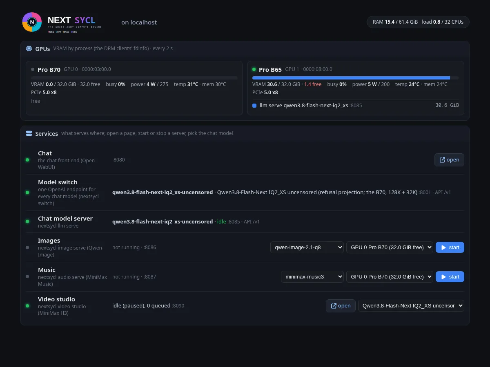

- **`switch`**: one OpenAI endpoint for a chat front end over the one model server that runs at a time. It lists the
  registry's enabled chat models (read on every request); a request naming another model asks the video studio to
  swap (`llm.mode`: it knows when a render holds a card), waits until the server answers as that model, and passes the
  request through, streamed answers included. The loaded model is not swapped out while it answers or within 90 s of
  its last request (that request gets a 409 naming it). Per entry: `tools: false` drops tool definitions, `tasks:
  false` declines a front end's background tasks. `--alias` keeps old model ids working. `--images`: the images API
  (`/v1/images/...`) goes to the image server and its model is listed while it runs - one base URL for chat and
  pictures.
- **`gpustat`**: the card's telemetry every few seconds into a JSON file the pages read: VRAM used (the DRM clients'
  `drm-resident-vram0` in /proc/*/fdinfo - root only) and total, busy %, power over a 15 s window, the power cap,
  temperatures, fan, the PCIe link it trained at and what the card and slot could do.

Example units: `docs/host/*.service.example`.

## Engine options: `--opt-NAME`

Every engine declares the options it takes beyond its kind's common ones; any command forwards them to it:
`--opt-NAME VALUE` (or `--opt-NAME` alone for a switch), NAME the option or the variable it sets. At load they set
those variables (what the engines and their kernels read; into the container too), per request they ride in the
request (`"options": {NAME: value}` in an API body). An option the engine does not take is an error that lists those
it does; `nextsycl llm engines`, `nextsycl image engines`, `nextsycl audio engines` show them all.

```sh
nextsycl image gen "a fox" --opt-int8 --opt-sigmas 1,0.9375,0.875,0.75,0.5,0.25     # int8 DiT, a 6-step schedule
nextsycl llm start qwen3.8-flash-next-iq2_xs --opt-chunk 4096 --opt-spec 4
curl localhost:8086/v1/images/generations -d '{"prompt": "a fox", "options": {"sigmas": "1,0.75,0.5,0.25"}}'
```

## Images

```sh
nextsycl models pull qwen-image-2.1-q8
nextsycl image gen "a red fox in fresh snow, morning light" [--model ID] [--size WxH | --aspect 16:9] [--steps N]
                   [--seed N] [--n N] [--sampler S] [--schedule S] [--shift X] [--cfg X --negative TEXT]
                   [--lora NAME[:SCALE]]... [--out FILE|DIR] [--rgba] [--gpu N]
nextsycl image edit "put a red knitted scarf on the fox" --image fox.png [--image ref.png]... [gen's options]
nextsycl image check <reference dump dir> [--stages te,dit,steps,vae | edit-pre,edit-te,edit-vae,edit-dit] [--gpu N]
```

**Edits and compositions.** Give the model pictures and the prompt becomes instructions: the first picture is the one
changed, the others are references the instructions name ("place the fox from picture 1 in front of the lighthouse
from picture 2"), up to 8. As Qwen-Image 2.1's pipeline does it: each picture resized (PIL's Lanczos, exactly) to
the output area at its aspect; seen by Qwen3-VL's vision tower (27 blocks, deepstack features into the first three
text layers) inside the prompt; encoded by the VAE's encoder, its latents put in the denoiser's sequence where the
prompt has the picture's slots (block-causal: text causal, each picture's block with itself and all before it). The
output takes the last picture's aspect unless a size is given. Checked against the pipeline's code at 512 and 1024
(`reference/qwenimage21/ref.py edit-*`): patches and positions exact, the vision tokens 2e-3, the VAE encoder 2e-3,
the denoiser 4e-4 over 12 steps, the picture within 6/255. An edit at 1024x1024 takes ~31 s on the B70 (40 steps;
the prefix of text and one 1024 picture is 4,119 tokens, computed once). Guidance: `--cfg` above 1 with
`--negative` (two passes a step; the pictures in both).

**Samplers and schedules.** ComfyUI's: 29 samplers (euler, euler_ancestral, heun, heunpp2, dpm_2, dpm_2_ancestral,
lms, dpmpp_2s_ancestral, dpmpp_sde, dpmpp_2m, dpmpp_2m_sde, dpmpp_2m_sde_heun, dpmpp_3m_sde, ddpm, lcm, ipndm,
ipndm_v, deis, res_multistep, res_multistep_ancestral, gradient_estimation, er_sde, seeds_2, seeds_3,
exp_heun_2_x0, exp_heun_2_x0_sde, ddim, uni_pc, uni_pc_bh2) and their schedulers (simple, sgm_uniform, karras,
exponential, ddim_uniform, beta, normal, linear_quadratic, kl_optimal) besides the model's own (`shift`), ported from
ComfyUI's code with its flow-model paths (`crates/diffusion` samplers.rs; `reference/samplers` runs ComfyUI's own
code: every sampler within 1.1e-6, every schedule within 8.3e-7). Euler on the model's schedule runs on the GPU
alone; the others step on the host (the latents, 1 MB at 1024x1024, cross each call). The ComfyUI schedules take the
model's own shift for the size unless `--shift` is given. Karras and exponential crowd the steps at the clean end,
which flow models handle badly - shift, simple, beta or normal suit them. The SDE samplers draw plain normals where
ComfyUI uses a Brownian tree: a seed gives another picture than ComfyUI's, equally valid.

`--lora` takes a registered LoRA (`nextsycl models pull qwen-image-2.1-uncensored-lora`) or a file; it is merged
into the DiT's matrices at load (PEFT, kohya and diffusers files; ~0.4 s, nothing a step), half or int8 alike, and
named in the PNG. Checked against the reference with the same LoRA merged in PyTorch: the latents after 20 steps
8.4e-4 off (without the LoRA, 3.3e-3).

Few-step models: `qwen-image-2.1-turbo-q8` (Viggle's v0.3 distill merged into the transformer: 6 steps) and the
LoRAs `qwen-image-2.1-turbo-lora`, `qwen-image-2.1-pruna-8step-lora`, `-5step-lora` each bring their own sigmas
(`NS_QI_SIGMAS`, `NS_QI_SIGMA_SHIFT` in their registry settings). All checked against the reference run with the
same files and schedules: turbo 6 steps 2.9e-3, Pruna 8 steps 2.2e-3, their images at most 2 / 4 of 255 off.
On the B70 a turbo picture takes 3.2 s: 1024x768 in half, 1024x1024 with `NS_QI_INT8=1` (6 steps, the prompt and the VAE included).

`gen` runs the engine in-process (the server path, `image serve | start | ps`, comes next); the PNG keeps the
prompt, model, seed, size and steps. `check` compares each stage with the dumps of `reference/qwenimage21/ref.py`.

### The image server and its web front end

```sh
nextsycl image serve qwen-image-2.1-q8 [--wfe] [--port 8086] [--host 0.0.0.0] [--gpu N] [--lora NAME[:SCALE]]...
                     [--set NAME=VALUE]... [--out DIR] [--cors ORIGIN]
nextsycl image start ...      # the same in the background (ready when it answers); image ps | logs [-f] | stop
```

From the host it runs the build image as container `nextsycl-image` (the GPU, `dist/`, the registry, the model's and
its LoRAs' files read-only, the output directory - default `~/.local/share/nextsycl/images` - writable) and serves:

- `POST /v1/images/generations` - OpenAI's images API: `prompt`, `n`, `size`, `response_format` (`b64_json` or `url`),
  `background: "transparent"` (RGBA); and ours: `steps`, `seed`, `sampler`, `schedule`, `shift`, `cfg`,
  `negative_prompt`, `loras` (`["name:scale"]` or `[{name, scale}]` - another set reloads the model with them
  merged, ~4 s; a few-step LoRA brings its own sigmas and steps). The answer's `nextsycl` field has the seconds, steps,
  seed, LoRAs and the card's energy (Wh). Every picture is saved with its settings in the PNG.
- `GET /v1/models`, `/health`, `/v1/images/files/<f>`, `/api/info` (the model, its defaults, samplers, schedules,
  LoRAs), `/api/progress`, `/api/history`, `/api/gpu`.
- `--wfe`: the web front end at `/` (`wfe/image`, built into `dist/wfe` by `./build.sh wfe`): H3's scheme - TSX on
  vendored snabbdom, compiled offline by the vendored TypeScript, one state object, panels, H3's stylesheet - with
  every option of a request, live progress (step, s/step, time left), the card's power, VRAM and temperatures, and
  the pictures made (an earlier session's too, read back from the PNGs). `node wfe/check.mjs` smoke-tests a running
  one (every module parses, the page renders headlessly).

Screenshots for a quick look when debugging the page (`docs/screenshots/shoot.py image http://localhost:8086
docs/screenshots` retakes them):

| Idle | Running | Done |
|---|---|---|
| 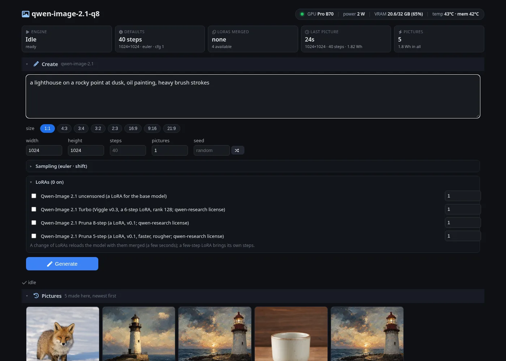 | 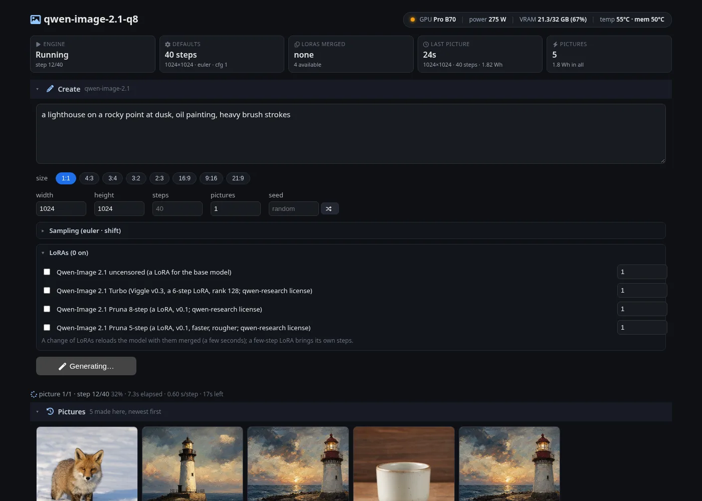 | 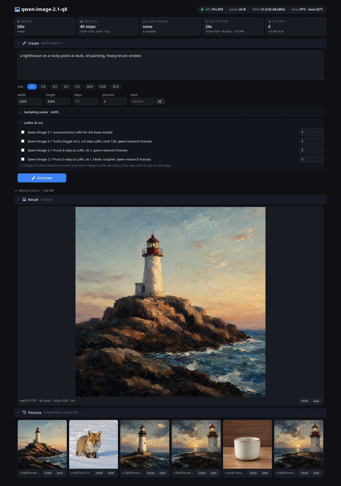 |

An edit - two pictures composed by the instructions (the page's Pictures section; "edit" on any picture made here
adds it):

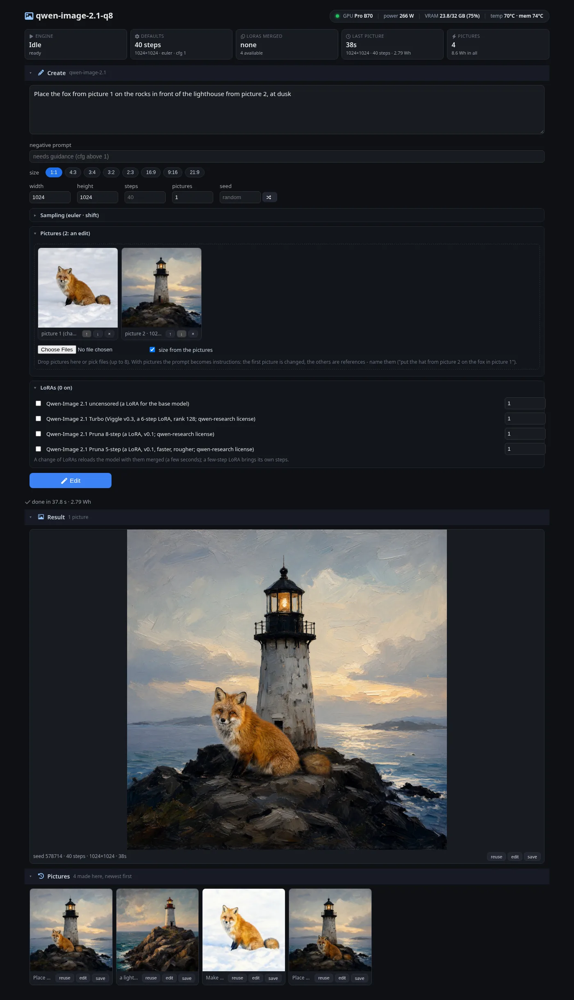

The API: `POST /v1/images/edits` takes OpenAI's multipart form (`image` / `image[]` files, `prompt` and the other
fields) or JSON with `images` (base64 or data URLs):

```sh
curl localhost:8086/v1/images/edits -F "image[]=@fox.png" -F "image[]=@lighthouse.png" \
     -F "prompt=Place the fox from picture 1 in front of the lighthouse from picture 2" -F response_format=url
```

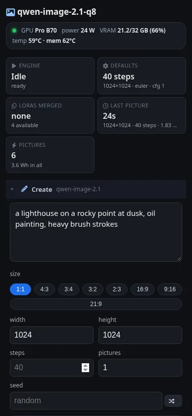

The stock model (`qwen-image-2.1-q8`, 40 steps, Euler, one picture) on each card alone, through the server
(`nextsycl image serve` timed by a client of its API, 2026-10-09). Each cell:
the request's time end to end (prompt, 40 steps, VAE, PNG) · one step of the DiT (from a 40-step and a 1-step run,
after a warm-up at that size) · the card's energy for the picture (its sensor). Load: start to the first `/health`
answer, files in the page cache.

| card, weights | load | 512×512 | 768×768 | 1024×768 | 1024×1024 | 1536×1536 |
|---|---|---|---|---|---|---|
| B70, half | 6.5 s | 5.4 s · 0.13 s/step · 0.41 Wh | 13.0 s · 0.32 s/step · 1.00 Wh | 17.4 s · 0.43 s/step · 1.33 Wh | 23.8 s · 0.59 s/step · 1.81 Wh | 62.1 s · 1.54 s/step · 4.74 Wh |
| B70, int8 (`--opt-int8`) | 7.5 s | 3.6 s · 0.09 s/step · 0.27 Wh | 8.8 s · 0.22 s/step · 0.67 Wh | 11.8 s · 0.29 s/step · 0.90 Wh | 16.5 s · 0.41 s/step · 1.26 Wh | 45.3 s · 1.12 s/step · 3.46 Wh |
| B65, half | 7.0 s | 8.5 s · 0.21 s/step · 0.47 Wh | 19.9 s · 0.49 s/step · 1.10 Wh | 27.1 s · 0.67 s/step · 1.50 Wh | 37.5 s · 0.93 s/step · 2.08 Wh | 98.4 s · 2.44 s/step · 5.46 Wh |
| B65, int8 (`--opt-int8`) | 7.5 s | 5.6 s · 0.14 s/step · 0.30 Wh | 13.2 s · 0.32 s/step · 0.72 Wh | 17.9 s · 0.44 s/step · 0.99 Wh | 25.0 s · 0.61 s/step · 1.38 Wh | 69.1 s · 1.70 s/step · 3.83 Wh |

Outside the steps a picture costs 0.1-0.5 s on the B70 and 0.2-1.0 s on the B65 (the prompt, the VAE, the PNG). The
B65 takes ~1.6x the B70's time in half and ~1.5x in int8; int8 is 1.4-1.5x faster than half on either card. The few-step
turbo model (`qwen-image-2.1-turbo-q8`, 6 steps) makes 1024×1024 in 3.2 s on the B70.

`NS_QI_INT8=1` (opt-in, in the environment or a registry entry's settings) keeps the DiT's block matrices as int8
ConvRot - each Q8_0 matrix rotated by the 256 x 256 Hadamard matrix along its inputs and quantized per row at load,
the activations quantized per row on the fly - on the card's int8 rate, twice its half one, in half the VRAM (~7 GB).
Its cost against the reference: velocity 5.8e-3 (half 3e-4), the latents after 20 steps 1.8e-2 (cosine 0.9998); the
1024x1024 fox against half's: PSNR 39.2 dB, mean pixel difference 0.57.

Where a 1024x1024 step goes on the B70 (`NS_QI_PROFILE=1`), int8: the block matrices ~50%, attention ~16% (ARK's
flash kernel on sycl-tla, `libnextsycl-flash.so`: 2.5 ms a block at 4k tokens, ~110 TFLOPS - oneDNN's fused SDPA
took 5.0; `NSD_FLASH=0` goes back to it), norms, gates, SwiGLU and RoPE ~16%. The VAE adds 0.7 s a picture (0.45 s of it its 3x3 convolutions).

## Video

MiniMax H3's engine, daemon, studio and tools (the sycl-h3 studio) as `nextsycl video`:

```sh
nextsycl models pull minimax-h3 [--dir DIR] [--from DIR]      # --from: adopt copies already on the machine
nextsycl video start [--model ID] [--engine ID]... [--gpu N ...] [--shared-gpu N ...]   # the daemon, in its container
nextsycl video serve [--bind ADDR] [--port N]                   # the studio: H3's web front end and clip queue
nextsycl video job generate --prompt "..." --width 768 --height 576 --seconds 5 --steps 8 --out DIR/clip.mp4 [-f]
nextsycl video ps [-a] | inspect ID | cancel ID... | rm ID... | status | gpus | unload [--gpu N] | logs [--web]
nextsycl video speech FILE --character NAME | scene SCENE.json | join PREFIX | speechpct CLIP... | plan measure
nextsycl video job <kind> ... --here                            # a job in this process (load, run, exit)
nextsycl video stop [--web | --all]
```

- **The engine** (`video/h3`, the `VideoEngine` contract): H3's h3-core, its jobs (generate, encode, decode,
  denoise, check-block, bench-blocks) and mp4 writer, on the diffusion kernels of `libnextsycl-video.so` (H3's under
  the `nsd_` prefix; SageAttention from `libnextsycl-flash.so`). Its options: `nextsycl video engines`.
- **The daemon** (`glue/serve` video::daemon): H3's queue, one worker process a GPU slot (it loads on the first
  job, unloads after `NS_VIDEO_IDLE`), the card lock and the front end's model switch for a GPU shared with chat.
- **The studio** (`video serve`, a host process): H3's front end (`wfe/video`, TSX on snabbdom) and its legacy API,
  the clip queue, projects, scenes, films, the language-model switch (`NS_VIDEO_LLM_MODES`).
- **Samplers**: a job's `sampler` and `schedule` take ComfyUI's names (`--sampler euler_ancestral`, `dpmpp_2m`,
  `uni_pc` ...; the same 29 samplers and 10 schedules as the image engine); without them, Euler on H3's own shifted
  schedule. The studio's Create form has both. A 3 s 768x576 clip, 8 steps on the B70 takes 46-52 s with euler,
  euler_ancestral or dpmpp_2m alike (one model call a step; heun-type samplers take two or three).
- Settings: `NS_VIDEO_MODEL`, `NS_VIDEO_ENGINES`, `NS_VIDEO_OUT`, `NS_VIDEO_GPUS`, `NS_VIDEO_SHARED_GPUS`,
  `NS_VIDEO_IDLE`, `NS_VIDEO_GPU_LOCK`, `NS_VIDEO_LLM_SWITCHER`, `NS_VIDEO_MODELS_DIR` (seen as /models: H3's paths
  in scene files, the pixel upscalers), `NS_VIDEO_LISTEN` / `_PORT`, `NS_VIDEO_STUDIO_DIR`, `NS_VIDEO_LLM_MODES`,
  `NS_VIDEO_TEMPLATES`, `NS_VIDEO_CHARACTERS` (`docs/video/characters.example.json`).
- Checked against H3's own `h3d` on the B70, the same clip: the latents differ from H3's by as much as two H3 runs
  differ from each other (cosine 0.996 - H3 is not bit-reproducible run to run), the frames the same scene; 8.0 s a
  denoising step either way at 896x672, 4.5 s (19,191 tokens).

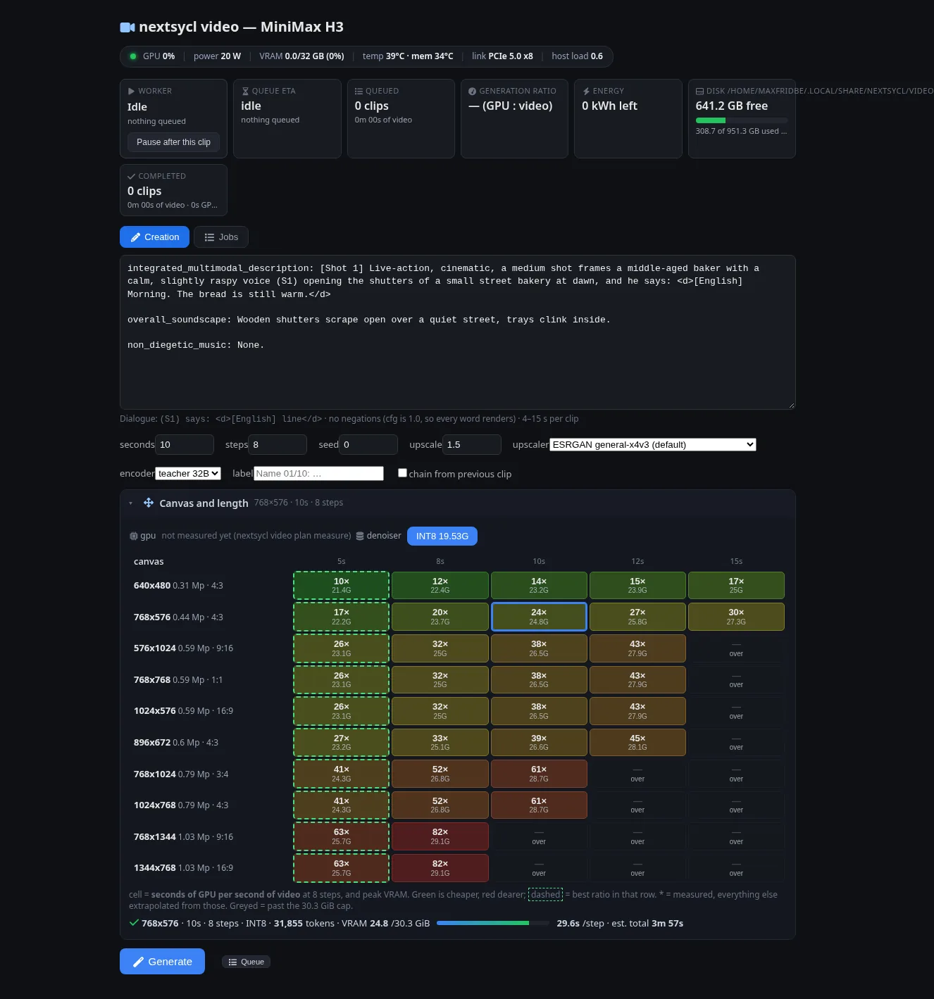

## Audio

MiniMax Music 3 (`audio/minimaxmusic3`): a song from its lyrics and a description of it - genre, tempo and key, mood,
the voice, the instruments, the arrangement.

```sh
nextsycl models pull minimax-music3 [--dir DIR] [--from DIR]   # --from: the checkpoint's directory, if downloaded
nextsycl audio gen "Genre: indie folk. BPM: 84. Vocals: male lead, gentle. Arrangement: acoustic guitar, banjo." \
                   --lyrics-file song.txt [--seconds 60] [--seed N] [--steps 30] [--cfg 1.7] [--out FILE|DIR] [--opt-int8 1]
nextsycl audio serve [minimax-music3] [--wfe] [--port 8087] [--host H] [--out DIR] [--gpu N]
nextsycl audio check <reference dump dir> [--stages ar,dit,voc,chunks] [--gpu N]
nextsycl audio engines | selftest [--gpu N]
```

Lyrics take structure tags on lines of their own (`[intro]`, `[verse]`, `[pre-chorus]`, `[chorus]`, `[bridge]`,
`[instrumental]`, `[solo]`, `[outro]`; text after a tag on its line is dropped, as the model was trained); no lyrics
makes an instrumental. `--seconds` is a limit: the model ends a song when it is done. The WAV carries the description,
the lyrics and the settings (its INFO chunk).

- **The pipeline**, one card: the prompt in the checkpoint's template and its classifier-free twin; the language
  model draws a semantic code a frame (25 a second, guidance 1.5, the best 50) and the depth decoder the seven residual
  codes after it, two rows a frame on the engine's own small-batch products and cached attention, the draws on the
  host; each frame's eight hidden states mixed into one conditioning row; the flow transformer makes the Flow-VAE
  latents in 200-frame windows 100 apart (30 Euler steps, guidance 1.7), each blended into the previous over their
  overlap; the decoder (DAC's, its convolutions on oneDNN) a window at a time, the overlaps cropped.
- **Checked** against MiniMax's own diffusers code (`reference/minimaxmusic3/ref.py`, float32 on the CPU, the same
  files), each stage from the reference's input: the prompt's tokens equal; the language model and the depth decoder
  over 51 frames forced to the reference's codes rel 4e-4 (half; int8 2-3e-2, cosine 0.9997); the condition 2e-6; the
  flow transformer's first velocity 1.4e-3 and the latents after 30 steps 1.2e-3; the decoder 8e-7; three windows
  with their overlaps, stitched, 3.6e-3.
- **The server** (`nextsycl audio serve`, the container `nextsycl-audio`): the reference server's endpoint - `POST
  /v1/audio/speech` with `input` (the lyrics), `instructions` (the description), `seed`, `max_new_tokens` (frames,
  25 a second) or `seconds`, and ours: `steps`, `cfg`, `options` - answering the WAV, or with `"response_format":
  "url"` JSON with its link; `/api/progress` (the phase: prompt, tokens, flow, decode), `/api/cancel`,
  `/api/history`, `/v1/audio/files/<f>` (byte ranges, for the player).

```sh
curl localhost:8087/v1/audio/speech -H 'content-type: application/json' -o song.wav -d '{"input": "[verse]\nCity
  lights are calling out my name\n[chorus]\nTonight we run", "instructions": "Genre: funk pop. BPM: 112. Slap bass,
  brass stabs. Vocals: confident male lead.", "seed": 11, "max_new_tokens": 1500}'
```

With `--wfe` the page at `/`: the description, the lyrics with the structure tags a click away, the length, the
seed, the steps and guidance; the phase and its progress while a song is made, a cancel; each song with its player,
settings, lyrics and the card's energy (`docs/screenshots/shoot.py audio http://localhost:8087 docs/screenshots`
retakes these):

| Idle | Composing | Done |
|---|---|---|
| 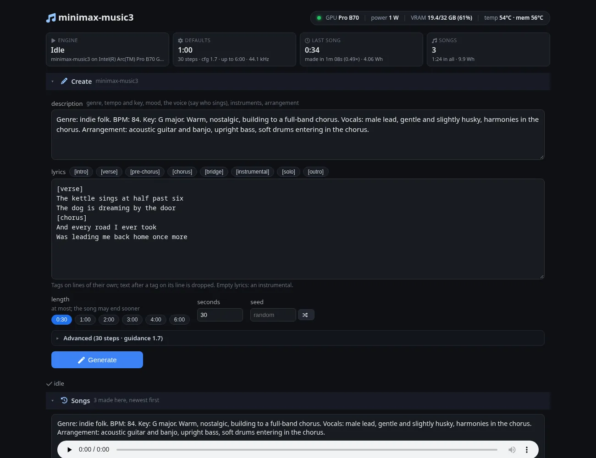 | 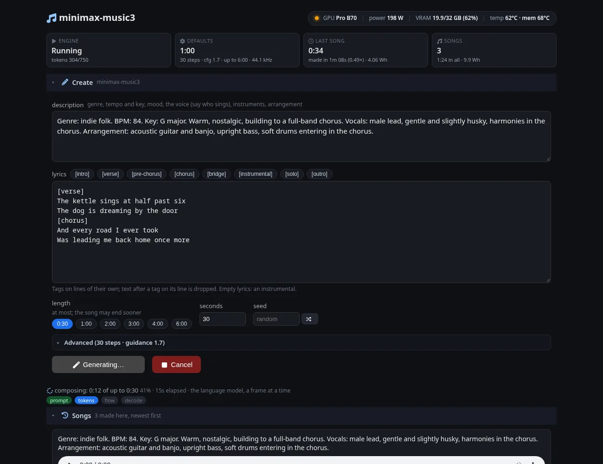 | 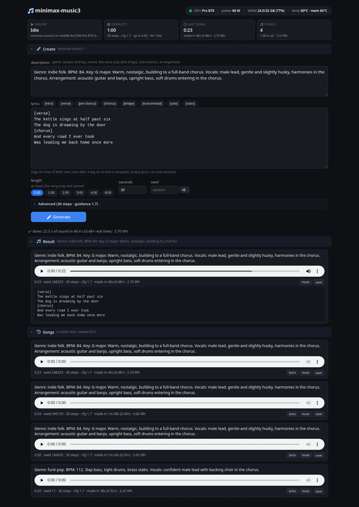 |

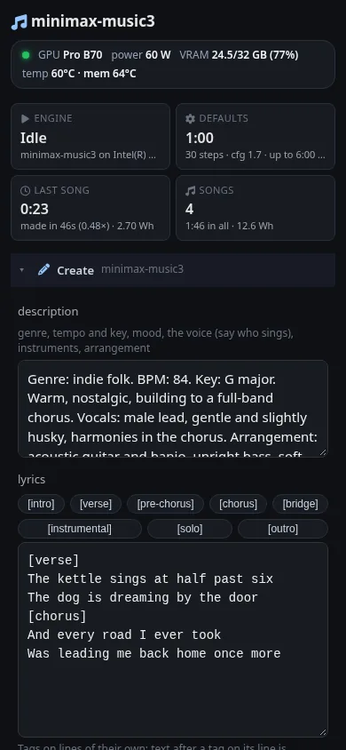

A minute of song (`nextsycl audio gen --seconds 60`, a pop-rock description and lyrics long enough not to end
sooner, 30 steps; 2026-10-09), each card alone; its phases as `gen` reports them. VRAM: the card's use with the
model loaded, and its peak over a 20 s song (the cache and the flow stage's buffers), through the server:

| card, language model | 60 s of song | tokens (1,500 frames) | flow (14 windows x 30 steps) | decode | VRAM, loaded / peak |
|---|---|---|---|---|---|
| B70, half | 117.8 s | 71.8 s · 20.9 frames/s | 42.0 s · 0.10 s/step | 3.8 s | 19.4 / 22.7 GiB |
| B70, int8 (`--opt-int8 1`) | 88.8 s | 42.7 s · 35.2 frames/s | 42.2 s | 3.8 s | 12.3 / 15.4 GiB |
| B70, int8 + flow int8 (`--opt-dit-int8 1`) | 80.0 s | 42.5 s · 35.3 frames/s | 33.5 s · 0.08 s/step | 3.7 s | |
| B65, half | 154.8 s | 89.1 s · 16.8 frames/s | 60.7 s · 0.14 s/step | 4.8 s | the same |
| B65, int8 | 136.2 s | 70.5 s · 21.3 frames/s | 60.7 s | 4.8 s | the same |

Real time is 25 frames a second: the B70 composes faster than real time in int8. `--opt-dit-int8 1` keeps the flow
transformer's block matrices as int8 ConvRot (rotated by the 256 x 256 Hadamard matrix along their inputs, quantized
per row; activations quantized on the fly): the latents after 30 steps 8.6e-3 off the reference (half 1.2e-3), cosine
0.99996. The language model's frame reads
all of its weights and, seven times, the depth decoder's (14 GB and 8 GB a frame in half) - ~78% of the B70's
memory bandwidth. A load takes 6 s with the files in the page cache (20 s from the disk). Running the flow stage
beside the frames on a second queue of the same card was tried: the card takes the two in turns (114.5 s, not less).

## Speed by model

Benchy v1 through the server (`nextsycl llm bench --sizes 20,2185,8000,40000,128000 --parallel 1`; 256 greedy tokens a
size, the prompt cache cleared before each), 8 October 2026. The Qwen3.8-Flash-Next family on one Arc Pro B70 (its
cold experts in pinned host memory, the MTP draft layer); GLM-5.3-Flash on the B70 and an Arc Pro B65. Input tokens
as each model's tokenizer counts them (Qwen 30 / 2,195 / 7,914 / 39,783 / 127,303; GLM 31 / 2,216 / 7,975 / 39,758 /
127,196 / 248,342). Strata's rows are its own numbers on the same B70 (its INTEL_PERFORMANCE.md, benchy v1).

Prompt read (PP), tokens/s:

| Model | 20 | 2K | 8K | 40K | 128K | 250K |
|---|---:|---:|---:|---:|---:|---:|
| Qwen3.8-Flash-Next IQ2_XS | 84 | 789 | 1,154 | 1,226 | 1,210 | - |
| IQ2_XS, refusal projection | 83 | 786 | 1,143 | 1,212 | 1,199 | - |
| Qwen3.8-Flash-Next Coder IQ1_M | 80 | 938 | 1,389 | 1,495 | 1,471 | - |
| Coder, refusal projection | 80 | 930 | 1,371 | 1,473 | 1,450 | - |
| Swift 1.5 IQ2_XS | 83 | 782 | 1,147 | 1,217 | 1,202 | - |
| GLM-5.3-Flash IQ2 (64K / 256K modes) | 27 | 456 | 759 | 1,108 | 1,134 | 1,026 |
| Strata: IQ2_XS | 60 | 745 | 1,050 | 1,117 | - | - |
| Strata: Coder IQ1_M | 57 | 875 | 1,285 | 1,392 | - | - |
| Strata: Swift 1.5 | 59 | 742 | 1,046 | 1,108 | - | - |

Decode (TG), tokens/s: warm (the same prompts a second time on one load), and in brackets the first pass after the
model loads:

| Model | 20 | 2K | 8K | 40K | 128K | 250K |
|---|---:|---:|---:|---:|---:|---:|
| Qwen3.8-Flash-Next IQ2_XS | 77.2 (75.6) | 82.7 (78.3) | 81.2 (74.4) | 75.6 (72.2) | 75.5 (69.9) | - |
| IQ2_XS, refusal projection | 78.3 (76.9) | 84.7 (77.6) | 82.5 (75.6) | 77.8 (72.0) | 72.3 (67.4) | - |
| Qwen3.8-Flash-Next Coder IQ1_M | 78.0 (71.5) | 77.5 (71.0) | 75.9 (70.9) | 77.0 (71.3) | 67.9 (62.9) | - |
| Coder, refusal projection | 78.4 (72.1) | 78.2 (72.0) | 69.8 (65.1) | 76.0 (70.8) | 71.6 (67.1) | - |
| Swift 1.5 IQ2_XS | 79.3 (77.7) | 85.8 (79.7) | 86.1 (78.7) | 82.4 (78.3) | 75.2 (69.4) | - |
| GLM-5.3-Flash IQ2 (64K / 256K modes) | (18.8) | (18.2) | (18.7) | (18.1) | (18.7) | (16.9) |
| Strata: IQ2_XS | 70.0 | 77.5 | 78.5 | 71.8 | - | - |
| Strata: Coder IQ1_M | 77.3 | 74.6 | 71.9 | 67.6 | - | - |
| Strata: Swift 1.5 | 77.1 | 74.8 | 75.5 | 63.1 | - | - |

The prompt speeds are the warm pass's (the first pass reads the same, but for its very first request: ~50 tokens/s
on the 20-token prompt). A model just loaded decodes 2-9% slower than the warm pass on new text: each
token's 16 per-layer-embedding rows come from a 27 GiB table in the file, and rows not in the page cache are read
from the disk (asked for together a window: `docs/architecture.md`, NS_QW_PLE_PREFETCH). The
projection modes cost nothing measurable. Draft acceptance varies with the text (61-86% here), and decode with it. On two cards the Qwen models decode slower than on
the B70 alone (Coder 2K 70.8 tok/s with the B70 first, 58.2 with the B65 first; `TODO.md`).

## Speed

GLM-5.3-Flash IQ2 (the ds4 file, 80 GB of experts) on an Arc Pro B70 and an Arc Pro B65, 7-8 October 2026, through
the server:

| | |
|---|---|
| prompt, 2K tokens (one chunk) | ~430 tokens/s |
| prompt, 8K tokens | ~740 tokens/s |
| prompt, 12K tokens | ~820 tokens/s |
| prompt, 36-40K tokens | ~1,100 tokens/s |
| prompt, 128K tokens | ~1,000 tokens/s (126 s) |
| prompt, 253K tokens | ~1,020 tokens/s (249 s) |
| decode, short context, MTP on | ~18-23 tokens/s by the text (70-90% of drafts accepted), greedy or at a temperature |
| decode at 128K / 253K of context | ~17 / ~15 tokens/s |
| a follow-up on a 253K document | ~4.5 s (its checkpoint mounted, in memory or from disk) |
| a chat sent while a 253K prompt is read | answered in ~10 s (the read stops for it at a chunk's end) |
| power while decoding | ~175-185 W for both cards (~1.6-1.9 kJ for a 170-200-token answer) |
| idle | ~9 W for both cards |
| load | ~18 s |

About 60% of the experts fit in VRAM (plus ~380 slots a GPU lent by the prompt arena while decode runs); the rest sit
in pinned host memory. At load VRAM takes the experts decode asked for most in earlier runs first (the expert profile
a stop saves beside the prompt cache: a new topic's first answer ~10% fewer swaps). At decode a missed expert is
swapped in over PCIe (both directions at once, on two copy queues, while the resident experts compute; the next
layer's likely experts prefetched). The copies are mostly hidden now: with every miss made free (a measurement,
`NS_FREE_MISSES=1`) decode would be at most 13% faster - its time is the GPUs' own work, spread over the experts'
kernels, KDA (~11 ms a token), MLA (~5), the draft block and the shared expert (`TODO.md`). `--gpu all` puts the GPU
that computes most last (it takes the head and the draft block); `NS_SPLIT` sets the layers per GPU. A prompt longer
than a chunk (6,144 tokens) runs the two GPUs as a pipeline: the first reads chunk n+1 while the second finishes
chunk n.

## Benchy

`nextsycl llm bench` runs Strata's benchy v1 (its prompts as text in `bench/v1`) against the running server, and sends
several requests at once. The latest run, `docs/benchy/v1-2026-10-07-q8.md` (B65 + B70, the B70 last; prompt chunks of
6,144, the q8 latent cache, the GPUs in a pipeline for prompts over a chunk):

| Input tokens | PP (tok/s) | TTFT (s) | TG (tok/s) | Drafts accepted | Energy (J) | Avg power (W) |
|---:|---:|---:|---:|---:|---:|---:|
| 31 | - | 1.3 | 18.0 | 91% | 1,359 | 159 |
| 2,216 | 456 | 5.2 | 18.1 | 76% | 3,380 | 178 |
| 7,975 | 759 | 10.9 | 18.7 | 77% | 5,199 | 215 |
| 39,758 | 1,108 | 36.3 | 18.1 | 76% | 14,978 | 299 |

Earlier: `v1-2026-10-07-mirror.md` (chunks of 4,096, fp16 latents) 435 / 762 / 1,011 tokens/s at 2K / 8K / 40K;
`v1-2026-10-06-prefetch.md` 332 / 314 / 416. Benchy decodes greedily; sampling at a temperature runs within a few
percent of it since the sampler selects its top 256 in linear time.

Several at once, before and after batched decode (`docs/benchy/v1-2026-10-06-parallel.md`; the short prompt, 256
tokens each):

| Clients at once | Tokens/s, all: one at a time | batched (NS_PARALLEL=2) | First token mean / max: one at a time | batched |
|---:|---:|---:|---:|---:|
| 1 | 17.6 | 17.0 | 1.1 / 1.1 s | 1.0 / 1.0 s |
| 2 | 18.1 | 20.3 | 5.7 / 10.4 s | 2.0 / 2.0 s |
| 4 | 17.9 | 19.8 | 15.8 / 29.1 s | 14.8 / 27.5 s (two at a time) |

`nextsycl batch-check` (the engine alone, no draft block): 2 conversations together 23-30 tokens/s in all against
16-18 one at a time (over 32 to 128 tokens: the longer, the more their experts differ), the tokens and logits
exactly those of each alone.

With NS_PARALLEL=2 two requests decode in one pass; a third waits for a free session. The batch's limits today: MLA
runs per session (its projections read once per conversation), and two conversations want more distinct experts a
layer (more swaps).

## LogProbChain

Thinking skews an answer's logprobs: the answer copies what the thinking wrote, so it looks certain. With
`"logprob_chain": true` every answer token's entry also carries `chain`: for it and each alternative, the logprob plus,
over this turn's earlier tokens equal to it, the attention its position gives each times that token's own logprob
(p' = p x prod p_j^a_j). The attention is the mean over MLA's 64 heads and 11 layers of the softmax weights of the pass
that produced the token. An example (`reference/logprob-chain-show.py` prints a response this way):

```
question: Which is larger, 9.11 or 9.9? Reply with just the number.   (reasoning_effort high, greedy)
thinking: '9.11 vs 9.9: 9.9 = 9.90 > 9.11. Answer: 9.9'
answer:   '9.9'

'9'        logprob  -0.0056   chained  -0.0078   attention to this turn 0.257
     echoes turn token #0 '9': attention 0.0121 x its logprob -0.1324
     echoes turn token #12 '9': attention 0.0026 x its logprob -0.2098
     echoes turn token #10 '9': attention 0.0031 x its logprob -0.0035
'.'        logprob  -0.0001   chained  -0.0005   attention to this turn 0.316
'9'        logprob  -0.0000   chained  -0.0023   attention to this turn 0.272
     echoes turn token #0 '9': attention 0.0086 x its logprob -0.1324
     echoes turn token #12 '9': attention 0.0047 x its logprob -0.2098
     echoes turn token #31 '9': attention 0.0226 x its logprob -0.0056
```

The last `9` reads as certain (-0.0000) but chains to -0.0023: most of it from the thinking's two hesitant `9`s.
Requests with it decode one token a pass (no draft block), a few small reads a layer more.

## Checking it

- `nextsycl check <model> <dump dir>`: the forward pass against a llama.cpp dump (`reference/llama-dump`), every
  step compared by cosine, the next token and the top logits.
- `nextsycl batch-check <model> [--prompts "a|b"] [--n N]`: conversations decoded together against each decoded
  alone - the same greedy tokens, the logits exactly equal - and the speed of both.
- `nextsycl spec-check <model> --prompt-file F [--rows 2..5]`: verify passes against one-token decode - must stay
  0 difference (greedy output with MTP equals greedy output without); `--layers [--at N] [--row k]` compares every
  named step of one row against a one-token pass, to find where they part. Check a long prompt too (past 2,048
  tokens the indexer runs: the 3-row drift it found lived there).
- `nextsycl llm bench --needle [--sizes 32768,131072,250000] [--depths 10,50,90]`: a passphrase placed at each depth of
  a long document, asked for at the end - can the running server find it (its context must hold the size).
- `NS_PROFILE=1 nextsycl llm generate ...`: seconds per section, the GPU synced at each boundary; `NS_PROFILE=gpu`: device
  timestamps instead (no syncs - the honest view of decode, where sections are tens of microseconds).
- `NS_PIPE_TRACE=1`: each pipeline stage's time a chunk and the GPUs' free VRAM; `NS_VRAM_GUARD_GIB=G`: a prompt read
  stops with an error before a GPU has less than G free.
- Switches for A/B measurements: `NS_DENSE_F16=0`, `NS_PROMPT_F16_MIN`, `NS_PREFILL_CHUNK`, `NS_HC_FUSED=0`,
  `NS_DECODE_LANES`, `NS_DECODE_DIRECT=1`, `NS_ARENA_MIB`, `NS_PREFETCH`, `NS_LEND=0`, `NS_SPLIT`, `NS_PIPELINE=0`,
  `NS_FUSED_MAX`, `NS_FUSED_DOWN_MAX`, `NS_ESIMD_MAX` (0 = off), `NS_KDA_COLS`, `NS_KV=f16`, `NS_MLA_DEC=0`,
  `NS_SPEC_SAMPLING=0`, `NS_SPEC_DRAFT_TEMP`, `NS_DRAFTS=2`, `NS_NGRAM=K`, `NS_EXPERT_PROFILE`, and
  `NS_FREE_MISSES=1` (wrong output: the speed decode would have with no expert copies).
- `reference/`: the offline studies and microbenchmarks - `expert-cache/` (cache, prefetch, pinning and split
  simulations on decode traces), `expand.cpp`, `esimd-fused.cpp`, `esimd-down.cpp` (the expert kernels alone),
  `mmvq-bw.cpp` (a decode product's bandwidth), `cpu-expert/` (an expert computed on the CPU), `profile/`.

## Lessons learned

What measuring this runtime on two Arc cards taught, most of it the hard way:

- **Bound the prize before building.** Make the cost free and time it: with every expert miss free decode was only
  13% faster (`NS_FREE_MISSES`), which ended a CPU-expert path that computed an expert twice as fast as its copy;
  simulate on a trace first (`reference/expert-cache`): pinning hot experts lost (the hot set follows the topic),
  filling VRAM by them at load won.
- **A microbenchmark lies three ways.** One expert reused stays in the L2 (rotate many); a constant fill is
  compressed by the GPU's memory (use random data); a naive reference kernel flatters the new one (the engine's
  own expansion was already 40% faster than the bench's). Confirm every win in the engine's own profile
  (`NS_PROFILE=gpu`, per GPU with `NS_PROFILE_PART`).
- **Exactness is the test that finds bugs.** Verify passes must equal one-token decode and batches each row alone,
  bit for bit (`spec-check`, `batch-check`) - and at long context too: 3-row passes drifted only past 2,048 tokens,
  where the indexer's 4-slot ring of keys was overwritten by rejected rows. A near-tie token flipping is not a bug;
  a growing difference is.
- **Two GPUs in turn is one GPU at a time.** Running the layers' halves as a pipeline (the first GPU a chunk ahead)
  read long prompts 1.4-1.7x faster; then the weaker card set the pace, and tuning per card (the KDA scan's columns
  by its compute units) mattered more than tuning per kernel.
- **Count every byte of VRAM, then guard it.** The expert budget kept a fixed margin while the forward pass's own
  buffers grew with the prompt chunk; past it the driver's spill path is the box's known hang. Budget them per
  chunk, stop before a GPU runs short (`NS_VRAM_GUARD_GIB`), and test VRAM changes through the server (its sessions
  are reserved), not only `generate`.
- **On an MoE, a row costs its experts.** A verify pass of 5 rows costs ~2.5x one of 2 (each token brings its own 8
  experts), so prompt-lookup drafts accepted 90% of the time still lost; raise the acceptance of the 2-row pass
  instead (speculative sampling).
- **Fusion pays where the decode is costly and shared.** Decoding 2-bit weights straight into the matrix units beat
  expand + oneMKL only once a work-group decoded each block once for all its threads (ESIMD, local memory) - and
  only for IQ2_XXS's table-driven gate | up: the down projection (Q2_K, no table, short rows) lost. Above ~256
  tokens oneMKL's tiles win anyway.
- **The host is part of the kernel.** Sorting the whole vocabulary to sample cost 6% of decode; one host wait on a
  router read a layer is fine while the GPU stays busy - check that it does (summed device time vs wall time).
- **Asynchronous means asynchronous.** A queued copy's host buffer must outlive it (a benchmark that freed it
  faulted the GPU); the host never waits on a queue's events (Level Zero v2 deadlocks - order on the device).
- **A long prompt must not hold the others.** Read it in chunks that stop for a newcomer, share the GPUs by time
  with those decoding, and keep its checkpoint (on disk) so the follow-up is seconds, not minutes.

## Standing on

- **[llama.cpp / ggml](https://github.com/ggml-org/llama.cpp):** the GGUF format, the quantization formats and their
  dot products, the reference every layer is checked against (`reference/llama-dump`).
- **[Strata](https://github.com/Niko1221/Strata):** the SYCL kernels in `kernels/strata` (MIT; see
  `kernels/strata/PROVENANCE.md`) - its Intel Arc port is this project author's own (Strata PR #423, merged in
  0.1.39) - and the ideas behind the expert store and the host mirror.
- **[ds4](https://github.com/antirez/ds4)** by antirez: how GLM-5.3's MTP block runs, and the file this runtime
  serves first.
- **Zhipu AI's GLM-5.3**, and the people who quantized it: the uncensored GSQ-RCO and IQ2 files.
- **Intel's oneAPI:** SYCL, oneMKL, and SYCLomatic, which migrated the kernels from CUDA.

## Releases

The version is `yy.mmdd.###`: the commit's date (UTC), then its number among that day's commits, from git
(`./version.sh`; `nextsycl version` prints the one built in). Every push to `main` is built and tested by
`.github/workflows/build.yml` and published as a release `v<version>` with `nextsycl-<version>-linux-x86_64.tar.gz`
(the program, the kernel libraries `libnextsycl-<kind>.so`, `ns.h`, the docs). Other branches and pull requests keep the tarball as a workflow
artifact.

## Docs

- `docs/architecture.md`: the layout - the foundation crates, each kind's contract and engines (`<kind>/<arch>`, their
  kernels in `kernels/<kind>/<arch>`), the glue, the program - its rules, and the engines' settings.
- `CONTRIBUTING.md`: porting a model from a kind's template, the rules (SYCL only; the layers), building, checking.
- `docs/glm5next.md`: the model's math, as this runtime computes it.
- `docs/256k-context.md`: long context - memory a token, the measured scaling, what 256K takes and what is left.
- `docs/benchy/`: every benchy run, the needle runs, the speculative-sampling sweep.
- `PLAN.md`, `TODO.md`, `NOTES.md`: where it is going, what is next, the files tried.

MIT licensed, as the kernels it imports.
